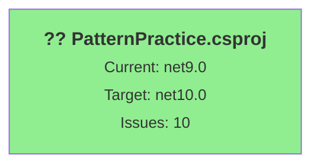

# .NET 10.0 Upgrade Plan

## Table of Contents

1. [Executive Summary](#executive-summary)
2. [Migration Strategy](#migration-strategy)
3. [Detailed Dependency Analysis](#detailed-dependency-analysis)
4. [Project-by-Project Plans](#project-by-project-plans)
5. [Package Update Reference](#package-update-reference)
6. [Breaking Changes Catalog](#breaking-changes-catalog)
7. [Risk Management](#risk-management)
8. [Testing & Validation Strategy](#testing--validation-strategy)
9. [Complexity & Effort Assessment](#complexity--effort-assessment)
10. [Source Control Strategy](#source-control-strategy)
11. [Success Criteria](#success-criteria)

---

## Executive Summary

### Scenario Description

Upgrade the PatternPractice solution from **.NET 9.0** to **.NET 10.0 (Long Term Support)**.

### Scope

**Projects Affected:** 1 project
- `PatternPractice\PatternPractice.csproj` (SDK-style .NET Core console application)

**Current State:**
- Target Framework: net9.0
- 3 NuGet packages (all compatible with net10.0)
- 152 code files, 3,632 lines of code
- 2 files with API compatibility incidents

**Target State:**
- Target Framework: net10.0
- Updated package reference (System.Data.DataSetExtensions to be removed)
- Resolved 8 source incompatible API issues related to legacy configuration system
- Estimated code impact: 8+ lines (~0.2% of codebase)

### Selected Strategy

**All-At-Once Strategy** - Single atomic upgrade operation.

**Rationale:**
- **Simple solution**: Only 1 project with no dependencies
- **Low complexity**: 3,632 LOC, 10 total issues (all low-medium severity)
- **Zero dependency depth**: Standalone console application
- **All packages compatible**: No blocking package incompatibilities
- **No security vulnerabilities**: Clean security posture
- **Low risk profile**: Straightforward framework version increment (net9.0 ¡ú net10.0)

### Complexity Assessment

**Discovered Metrics:**
- **Project Count:** 1
- **Dependency Depth:** 0 (leaf node, no dependencies or dependants)
- **Total Issues:** 10 (2 mandatory, 8 potential)
- **High-Risk Items:** 0
- **Security Vulnerabilities:** 0
- **Code Files Affected:** 2 out of 152
- **API Issues:** 8 source incompatible (all related to System.Configuration.ConfigurationManager)

**Classification:** ?? **Simple Solution**

### Critical Issues

**None identified.** All issues are source incompatibilities that can be resolved during compilation phase.

**Package Considerations:**
- `System.Data.DataSetExtensions` (4.5.0) - Functionality now included in framework, package reference should be removed

**API Compatibility:**
- 8 source incompatible API usages in `System.Configuration.ConfigurationManager.AppSettings`
- Already using `System.Configuration.ConfigurationManager` NuGet package (10.0.1) which provides compatibility bridge
- No binary incompatibilities or behavioral changes detected

### Recommended Approach

**Single-phase atomic upgrade:**
1. Update project file target framework
2. Remove redundant package reference
3. Build solution to identify compilation errors
4. Fix source incompatibilities (if any surface during build)
5. Validate solution builds and runs successfully

### Iteration Strategy

**Fast Batch Approach** (2-3 iterations):
- **Phase 1: Foundation** (Iterations 1.1-1.3) ? Complete
- **Phase 2: Foundation Details** (Iterations 2.1-2.3) - Next
- **Phase 3: Project Details** (Single iteration for all sections) - Final

**Estimated Total Iterations:** 6-7

---

## Migration Strategy

### Approach Selection

**Selected Strategy: All-At-Once**

**Justification:**

| Criterion | Assessment | Decision Factor |
|-----------|------------|-----------------|
| **Project Count** | 1 project | ? Well below 5-project threshold for all-at-once |
| **Dependency Structure** | Zero dependencies | ? No coordination complexity |
| **Codebase Size** | 3,632 LOC | ? Small, manageable scope |
| **Package Compatibility** | 100% compatible | ? No blocking package issues |
| **Security Vulnerabilities** | None | ? No urgent security-driven sequencing needed |
| **Test Coverage** | Not assessed (assumed present) | ?? Will validate during testing phase |
| **Risk Profile** | Low (framework increment only) | ? net9.0 ¡ú net10.0 is low-risk upgrade |
| **Team Coordination** | Single project | ? Minimal coordination required |

**Conclusion:** All characteristics align with All-At-Once strategy criteria. The upgrade can be completed as a single atomic operation with minimal risk.

### All-At-Once Strategy Rationale

**Why All-At-Once is Optimal:**

1. **Atomic Simplicity**: Single project means no multi-targeting complexity or incremental rollout challenges
2. **Framework Compatibility**: .NET 9.0 ¡ú 10.0 is a standard LTS upgrade path with strong backward compatibility
3. **Package Readiness**: All dependencies already support net10.0 (or are framework-included)
4. **Fast Completion**: Single coordinated change minimizes total upgrade duration
5. **Clean Testing**: One comprehensive validation cycle vs. multiple phased tests
6. **No Intermediate States**: Avoid complexity of maintaining multiple framework versions

**Alternative Considered: Incremental Migration**
- **Rejected** - Unnecessary overhead for single-project solution
- Would introduce multi-targeting complexity without meaningful risk reduction
- No dependency ordering constraints to warrant phased approach

### Dependency-Based Ordering

**Not Applicable** - Single project has no inter-project dependencies.

**Ordering Principle Applied:**
- External NuGet packages are already compatible, no package upgrade sequencing required
- Framework upgrade happens atomically

### Parallel vs Sequential Execution

**Sequential Execution** (only option for single project):

1. **Update project file** ¡ú Modify `PatternPractice.csproj`
2. **Remove redundant package** ¡ú `System.Data.DataSetExtensions`
3. **Restore dependencies** ¡ú `dotnet restore`
4. **Build solution** ¡ú Identify compilation errors (if any)
5. **Fix source incompatibilities** ¡ú Address `ConfigurationManager.AppSettings` issues (if needed)
6. **Rebuild and verify** ¡ú Ensure 0 errors, 0 warnings
7. **Test validation** ¡ú Run application, verify functionality

**Rationale:** Each step depends on successful completion of the previous step. Parallelization not applicable.

### Phase Definitions

#### Phase 0: Preparation (if needed)
- **Not Required** - .NET 10.0 SDK presence will be validated before execution
- No global.json constraints identified

#### Phase 1: Atomic Upgrade
**Scope:** All project file updates, package cleanup, dependency resolution, and compilation fixes

**Operations** (performed as single coordinated batch):
1. Update `PatternPractice.csproj` TargetFramework to net10.0
2. Remove `System.Data.DataSetExtensions` package reference
3. Restore NuGet packages
4. Build solution
5. Fix any compilation errors related to API compatibility
6. Rebuild to verify 0 errors

**Deliverables:**
- ? Solution builds successfully with 0 errors
- ? Solution builds with 0 warnings
- ? All packages restored without conflicts

**Expected Duration:** Low complexity (relative rating)

#### Phase 2: Validation
**Scope:** Functional testing and runtime verification

**Operations:**
1. Run application with standard test cases
2. Verify configuration system functionality (AppSettings access)
3. Spot-check design pattern implementations
4. Confirm no runtime exceptions

**Deliverables:**
- ? Application starts without errors
- ? Configuration values load correctly
- ? Core functionality operates as expected

**Expected Duration:** Low complexity (relative rating)

### All-At-Once Strategy Specific Considerations

**Single Commit Approach:**
- All changes should be committed together as one atomic upgrade
- Commit message: "Upgrade to .NET 10.0 (net9.0 ¡ú net10.0)"
- Ensures clean Git history without intermediate broken states

**Build Validation Strategy:**
- Single comprehensive build after all changes applied
- No intermediate build checkpoints needed (only 1 project)

**Rollback Strategy:**
- Simple: `git revert` of single upgrade commit
- Or: `git checkout master` to return to pre-upgrade state
- Low risk due to atomic nature of changes

---

## Detailed Dependency Analysis

### Dependency Graph Summary

The solution contains a **single standalone project** with no inter-project dependencies.



**Legend:**
- ?? SDK-style project
- ?? Green = Low complexity, straightforward upgrade

### Project Groupings by Migration Phase

**Phase 1: Atomic Upgrade (All Projects)**
- `PatternPractice\PatternPractice.csproj`

**Rationale:** Single project solution requires no phasing¡ªall changes occur in one coordinated operation.

### Critical Path Identification

**No critical path complexity** - Single project means linear execution:
1. Update project file
2. Remove redundant package
3. Build and validate

**Dependencies:**
- **External NuGet packages:** 3 (all compatible)
  - `Microsoft.CSharp` 4.7.0 ?
  - `System.Configuration.ConfigurationManager` 10.0.1 ?
  - `System.Data.DataSetExtensions` 4.5.0 (?? remove - included in framework)
- **Framework references:** None explicitly required
- **Project dependencies:** None

### Circular Dependencies

**None.** This is a standalone console application with no circular reference risks.

### Migration Order

**Single-step migration:**
1. `PatternPractice.csproj` - Update TargetFramework from net9.0 to net10.0
2. Remove `System.Data.DataSetExtensions` package reference
3. Restore dependencies
4. Build and fix any compilation errors
5. Validate functionality

---

## Project-by-Project Plans

### Project: PatternPractice\PatternPractice.csproj

**Current State:**
- **Target Framework:** net9.0
- **Project Type:** SDK-style .NET Core console application (DotNetCoreApp)
- **Files:** 154 total, 2 with API compatibility incidents
- **Lines of Code:** 3,632
- **Dependencies:** 0 project dependencies
- **Dependants:** 0 (top-level application)
- **NuGet Packages:** 3
  - `Microsoft.CSharp` 4.7.0
  - `System.Configuration.ConfigurationManager` 10.0.1
  - `System.Data.DataSetExtensions` 4.5.0

**Target State:**
- **Target Framework:** net10.0
- **NuGet Packages:** 2 (remove System.Data.DataSetExtensions)
  - `Microsoft.CSharp` 4.7.0 (no change - compatible)
  - `System.Configuration.ConfigurationManager` 10.0.1 (no change - compatible)
- **Code Changes:** None expected (API is source-compatible via NuGet package)

**Migration Steps:**

#### 1. Prerequisites
- ? .NET 10.0 SDK installed
- ? No global.json constraints

#### 2. Update Project File
**File:** `PatternPractice\PatternPractice.csproj`

**Change:**
```xml
<!-- Current -->
<TargetFramework>net9.0</TargetFramework>

<!-- Target -->
<TargetFramework>net10.0</TargetFramework>
```

**Remove redundant package:**
```xml
<!-- Remove this PackageReference -->
<PackageReference Include="System.Data.DataSetExtensions" Version="4.5.0" />
```

**Rationale:** System.Data.DataSetExtensions functionality is now included in the .NET 10.0 framework reference.

#### 3. Package Updates

| Package | Current | Target | Action | Projects | Update Reason |
|---------|---------|--------|--------|----------|---------------|
| Microsoft.CSharp | 4.7.0 | 4.7.0 | No change | PatternPractice.csproj | Already compatible with net10.0 |
| System.Configuration.ConfigurationManager | 10.0.1 | 10.0.1 | No change | PatternPractice.csproj | Already compatible with net10.0; provides legacy config support |
| System.Data.DataSetExtensions | 4.5.0 | (remove) | **Remove** | PatternPractice.csproj | Included in framework |

#### 4. Expected Breaking Changes

**API Compatibility Assessment:**

The assessment flagged 8 source incompatible API usages in `ConfigurationManager.cs` (lines 6-9):

```csharp
using static System.Configuration.ConfigurationManager;

public static class ConfigManager
{
    public static string MethodFactoryKey => AppSettings["FactoryMethod"];
    public static string AbstractFactoryKey => AppSettings["AbstractFactory"];
    public static string BuilderKey => AppSettings["Builder"];
    public static string AdapterKey => AppSettings["Adapter"];
}
```

**Expected Behavior:**
- **No code changes required** - The `System.Configuration.ConfigurationManager` NuGet package (10.0.1) provides full compatibility bridge
- The "source incompatible" flags indicate the API would be incompatible *without* the NuGet package
- Since the project already references the package, no issues expected

**Validation:**
- Build the project after framework update
- If compilation errors occur, verify the NuGet package is properly restored
- Runtime testing: verify AppSettings values load correctly from App.config

**Potential Issues (Low Probability):**
- None expected - this is a well-supported compatibility pattern

#### 5. Code Modifications

**Expected:** None required

**If issues arise during build:**
1. Verify `System.Configuration.ConfigurationManager` package is restored
2. Check that `App.config` file is properly configured as Content/CopyToOutput
3. Ensure using directives are intact

**Files to Monitor:**
- `PatternPractice\ConfigurationManager.cs` (lines 6-9) - AppSettings usage
- `PatternPractice\App.config` (if exists) - configuration values

#### 6. Testing Strategy

**Build Validation:**
- [ ] Solution builds without errors
- [ ] Solution builds without warnings
- [ ] NuGet packages restore successfully
- [ ] No package version conflicts

**Functional Testing:**
- [ ] Application starts without exceptions
- [ ] Configuration values load correctly:
  - Verify `ConfigManager.MethodFactoryKey` returns expected value
  - Verify `ConfigManager.AbstractFactoryKey` returns expected value
  - Verify `ConfigManager.BuilderKey` returns expected value
  - Verify `ConfigManager.AdapterKey` returns expected value
- [ ] Core design pattern implementations function correctly

**Runtime Testing:**
- [ ] No runtime exceptions during normal operation
- [ ] Application behavior unchanged from net9.0 version

#### 7. Validation Checklist

- [ ] TargetFramework updated to net10.0 in .csproj
- [ ] System.Data.DataSetExtensions package reference removed
- [ ] `dotnet restore` completes successfully
- [ ] `dotnet build` completes with 0 errors
- [ ] `dotnet build` completes with 0 warnings
- [ ] Application runs successfully
- [ ] Configuration system works (AppSettings accessible)
- [ ] No package dependency conflicts
- [ ] No security vulnerabilities introduced

---

## Package Update Reference

### Package Status Summary

| Status | Count | Packages |
|--------|-------|----------|
| ? No Change (Compatible) | 2 | Microsoft.CSharp, System.Configuration.ConfigurationManager |
| ??? Remove (Framework Included) | 1 | System.Data.DataSetExtensions |
| **Total** | **3** | |

### Detailed Package Matrix

| Package | Current | Target | Action | Projects | Update Reason |
|---------|---------|--------|--------|----------|---------------|
| Microsoft.CSharp | 4.7.0 | 4.7.0 | No change | PatternPractice.csproj | Already compatible with net10.0 |
| System.Configuration.ConfigurationManager | 10.0.1 | 10.0.1 | No change | PatternPractice.csproj | Already compatible with net10.0; provides legacy config support |
| System.Data.DataSetExtensions | 4.5.0 | (remove) | **Remove** | PatternPractice.csproj | Included in framework |

### Package Removal Details

#### System.Data.DataSetExtensions

**Current Version:** 4.5.0  
**Action:** Remove package reference  
**Reason:** The functionality provided by this package is now included directly in the .NET 10.0 framework reference.

**Migration Path:**
1. Remove `<PackageReference Include="System.Data.DataSetExtensions" Version="4.5.0" />` from PatternPractice.csproj
2. No code changes required - framework provides equivalent APIs
3. Verify no compilation errors after removal

**Risk:** ? Low - Standard framework consolidation, no API changes expected

---

## Breaking Changes Catalog

### Overview

**Total Breaking Changes:** 0 actual breaking changes (8 flagged as source incompatible, but mitigated by NuGet package)

**Severity Distribution:**
- ?? High (Binary Incompatible): 0
- ?? Medium (Source Incompatible): 8 (mitigated)
- ?? Low (Behavioral Change): 0

### Framework Breaking Changes

**Category: .NET 9.0 ¡ú .NET 10.0 Upgrade**

**Status:** ? No breaking changes expected

**Rationale:**
- .NET 10.0 (LTS) maintains strong backward compatibility with .NET 9.0 (STS)
- No major API removals between these versions
- Project uses stable, well-supported APIs

### Package Breaking Changes

**None identified** - All packages remain at compatible versions.

### Source Incompatible APIs (Mitigated)

#### System.Configuration.ConfigurationManager API

**API:** `System.Configuration.ConfigurationManager.AppSettings`  
**Occurrences:** 4 property accesses (lines 6-9 in ConfigurationManager.cs)  
**Flagged Severity:** ?? Source Incompatible  
**Actual Risk:** ? Mitigated

**Description:**
The `System.Configuration.ConfigurationManager` type and its `AppSettings` property were flagged as source incompatible because they are not part of the core .NET framework. However, the project already references the `System.Configuration.ConfigurationManager` NuGet package (10.0.1), which provides full compatibility.

**Migration Path:**
- ? **No action required** - Package already in place
- Package version 10.0.1 is compatible with net10.0
- API surface remains unchanged

**Code Example (No Changes Needed):**
```csharp
using static System.Configuration.ConfigurationManager;

public static class ConfigManager
{
    public static string MethodFactoryKey => AppSettings["FactoryMethod"];
    // ... additional properties using AppSettings
}
```

**Validation:**
- Build project after upgrade
- Verify AppSettings values load correctly at runtime
- No code changes expected

### Configuration Changes

**None required** - Application configuration (App.config) remains compatible.

### Behavioral Changes

**None identified** - No behavioral changes expected between .NET 9.0 and .NET 10.0 for the APIs used in this project.

### Potential Runtime Considerations

**Configuration System:**
- App.config values must be accessible at runtime
- Ensure App.config is copied to output directory (CopyToOutputDirectory = Always/PreserveNewest)
- Default behavior should continue working unchanged

---

## Risk Management

### High-Level Risk Assessment

**Overall Risk Level:** ?? **Low**

**Justification:**
- Single project with no dependencies
- Framework increment (net9.0 ¡ú net10.0) with strong backward compatibility
- All packages compatible
- No security vulnerabilities
- Small code surface area affected (2 files, 8+ LOC)
- Well-understood migration path

### Risk Matrix

| Risk Area | Risk Level | Description | Mitigation |
|-----------|------------|-------------|------------|
| **Framework Compatibility** | ?? Low | .NET 9.0 ¡ú 10.0 is LTS upgrade with strong compatibility | Comprehensive build testing |
| **Package Compatibility** | ?? Low | All packages compatible or framework-included | Package restore validation |
| **API Breaking Changes** | ?? Low | No actual breaking changes (mitigated by NuGet) | Build-time verification |
| **Configuration System** | ?? Medium | Legacy config system requires runtime validation | Functional testing of AppSettings |
| **Build System** | ?? Low | SDK-style project, modern tooling | Standard dotnet CLI commands |
| **Dependency Conflicts** | ?? Low | Only 2 remaining packages, no complex dependency tree | Package restore check |
| **Runtime Behavior** | ?? Low | No behavioral changes expected | Application smoke testing |
| **Rollback Complexity** | ?? Low | Single atomic commit, easy to revert | Git revert strategy |

### High-Risk Changes

**None identified.**

### Security Vulnerabilities

**Status:** ? **None detected**

**Package Security Assessment:**
- `Microsoft.CSharp` 4.7.0 - No known vulnerabilities
- `System.Configuration.ConfigurationManager` 10.0.1 - No known vulnerabilities
- `System.Data.DataSetExtensions` 4.5.0 - Being removed (no impact)

**Recommendations:**
- Continue monitoring NuGet packages for security updates
- Consider upgrading to latest package versions in future maintenance cycles

### Contingency Plans

#### Scenario 1: Build Fails After Framework Update

**Symptoms:**
- Compilation errors after updating TargetFramework to net10.0
- Missing type or namespace errors

**Diagnosis:**
1. Check NuGet package restore completed successfully
2. Verify `System.Configuration.ConfigurationManager` package is restored
3. Check for conflicting package versions

**Resolution:**
1. Run `dotnet restore --force`
2. Clean solution: `dotnet clean`
3. Rebuild: `dotnet build`
4. If errors persist, check package compatibility with `dotnet list package`

**Rollback:** Revert TargetFramework to net9.0, rebuild

#### Scenario 2: ConfigurationManager.AppSettings Not Working at Runtime

**Symptoms:**
- Application starts but AppSettings values are null
- Configuration not loading correctly

**Diagnosis:**
1. Verify App.config exists and is copied to output directory
2. Check App.config format and structure
3. Verify NuGet package `System.Configuration.ConfigurationManager` is present

**Resolution:**
1. Ensure App.config Build Action = "Content"
2. Set Copy to Output Directory = "Copy if newer"
3. Verify appSettings section in App.config is well-formed
4. Test with hardcoded values to isolate configuration vs. code issue

**Rollback:** Revert to net9.0 and investigate configuration separately

#### Scenario 3: Package Restore Failures

**Symptoms:**
- NuGet restore errors
- Missing package references

**Diagnosis:**
1. Check NuGet feed connectivity
2. Verify package versions exist on NuGet.org
3. Check for package cache corruption

**Resolution:**
1. Clear NuGet cache: `dotnet nuget locals all --clear`
2. Restore packages: `dotnet restore`
3. If specific package fails, try `dotnet add package <PackageName> --version <Version>`

**Rollback:** Restore from previous package lock file or revert project changes

#### Scenario 4: System.Data.DataSetExtensions Removal Causes Issues

**Symptoms:**
- Build errors after removing System.Data.DataSetExtensions package
- Missing extension methods or types

**Diagnosis:**
1. Identify specific APIs that fail to compile
2. Check if framework reference includes required APIs
3. Verify if code actually uses DataSet extensions

**Resolution:**
1. If APIs are missing, re-add package temporarily
2. Investigate if alternative APIs available in framework
3. Consider updating code to use modern alternatives

**Rollback:** Re-add package reference if functionality required

### Rollback Strategy

**Approach:** Single commit revert

**Steps:**
1. **Quick Rollback:**
   ```bash
   git revert HEAD
   ```
   OR
   ```bash
   git checkout master
   git branch -D upgrade-to-NET10
   ```

2. **Verify Rollback:**
   ```bash
   dotnet restore
   dotnet build
   dotnet run
   ```

3. **Document Issues:**
   - Capture build errors/warnings
   - Note unexpected behaviors
   - Preserve logs for analysis

**Recovery Time:** < 5 minutes (simple revert)

**Data Loss Risk:** None - code changes only, no data migration

---

## Testing & Validation Strategy

### Overview

**Testing Approach:** Single-phase comprehensive validation after atomic upgrade

**Test Levels:**
1. **Build Validation** - Verify compilation success
2. **Package Validation** - Verify dependency resolution
3. **Functional Testing** - Verify application behavior
4. **Smoke Testing** - Verify core scenarios work

### Phase-by-Phase Testing Requirements

#### Phase 1: Atomic Upgrade - Post-Build Validation

**Timing:** Immediately after project file update and package removal

**Build Tests:**
- [ ] `dotnet restore` completes without errors
- [ ] `dotnet build` completes with exit code 0
- [ ] Build produces 0 errors
- [ ] Build produces 0 warnings
- [ ] Output directory contains compiled assemblies

**Package Tests:**
- [ ] NuGet package restore log shows success
- [ ] Only 2 packages remain (Microsoft.CSharp, System.Configuration.ConfigurationManager)
- [ ] No package version conflicts reported
- [ ] No missing package warnings

**Expected Outcome:**
- ? Clean build with no errors or warnings
- ? All packages restored successfully

**If Tests Fail:**
- Review build output for specific errors
- Check package restore logs
- Verify .NET 10.0 SDK is active: `dotnet --version`
- Apply contingency plans from Risk Management section

#### Phase 2: Validation - Functional Testing

**Timing:** After successful build completion

**Configuration System Tests:**

Test the `ConfigManager` static class functionality:

```csharp
// Test 1: Verify AppSettings values are accessible
var methodFactory = ConfigManager.MethodFactoryKey;
Assert.NotNull(methodFactory, "MethodFactoryKey should not be null");

var abstractFactory = ConfigManager.AbstractFactoryKey;
Assert.NotNull(abstractFactory, "AbstractFactoryKey should not be null");

var builder = ConfigManager.BuilderKey;
Assert.NotNull(builder, "BuilderKey should not be null");

var adapter = ConfigManager.AdapterKey;
Assert.NotNull(adapter, "AdapterKey should not be null");
```

**Application Tests:**
- [ ] Application starts without exceptions
- [ ] Configuration values load (check console output or debug)
- [ ] Core pattern factories instantiate correctly
- [ ] No runtime exceptions during normal flow

**Smoke Tests:**
- [ ] Run application with default configuration
- [ ] Verify expected console output
- [ ] Test at least one design pattern implementation
- [ ] Confirm application exits cleanly

**Expected Outcome:**
- ? Application runs successfully
- ? All configuration values load correctly
- ? No runtime exceptions
- ? Behavior matches .NET 9.0 version

**If Tests Fail:**
- Check App.config file location and build action
- Verify System.Configuration.ConfigurationManager package is loaded at runtime
- Review application logs/console output for error details
- Apply contingency plans from Risk Management section

### Smoke Tests (Quick Validation)

**Purpose:** Rapid validation that upgrade succeeded without detailed testing

**Execution Time:** < 2 minutes

**Steps:**
1. **Build Check:**
   ```bash
   dotnet build --configuration Release
   ```
   Expected: Build succeeded, 0 errors, 0 warnings

2. **Run Check:**
   ```bash
   dotnet run --project PatternPractice\PatternPractice.csproj
   ```
   Expected: Application starts, displays menu/output, no exceptions

3. **Config Check:**
   - Add debug output to verify ConfigManager properties
   - Confirm values match App.config settings

4. **Exit Check:**
   - Application terminates cleanly
   - No error codes

**Pass Criteria:** All 4 checks complete successfully

### Comprehensive Validation

**Purpose:** Thorough verification before marking upgrade complete

**Execution Time:** ~10-15 minutes

**Test Categories:**

#### 1. Build & Compilation
- [ ] Debug configuration builds
- [ ] Release configuration builds
- [ ] No compiler warnings in either configuration
- [ ] Output assemblies target net10.0 (verify with `dotnet --info` on output DLL)

#### 2. Package & Dependencies
- [ ] `dotnet list package` shows correct versions
- [ ] No vulnerable packages: `dotnet list package --vulnerable`
- [ ] No deprecated packages: `dotnet list package --deprecated`
- [ ] No package downgrades occurred

#### 3. Configuration System
- [ ] App.config file is copied to output directory
- [ ] ConfigManager.MethodFactoryKey returns expected value
- [ ] ConfigManager.AbstractFactoryKey returns expected value
- [ ] ConfigManager.BuilderKey returns expected value
- [ ] ConfigManager.AdapterKey returns expected value
- [ ] No null reference exceptions when accessing AppSettings

#### 4. Application Functionality
- [ ] Application entry point (Program.Main) executes
- [ ] ApplicationChooser functionality works
- [ ] Design pattern implementations load correctly
- [ ] Factory patterns create instances
- [ ] No exceptions during typical usage

#### 5. Regression Testing
- [ ] Behavior matches .NET 9.0 version
- [ ] No performance degradation (subjective check)
- [ ] Same console output for same inputs
- [ ] All previously working features still work

#### 6. Environment Validation
- [ ] Verify runtime framework: `dotnet --list-runtimes` includes 10.0.x
- [ ] Verify SDK: `dotnet --version` is 10.0.x or higher
- [ ] Check project file: TargetFramework = net10.0
- [ ] Check assembly metadata (if needed)

**Pass Criteria:** All checklist items complete successfully

### Test Execution Order

**Recommended Sequence:**

1. **Build Validation** (Phase 1) - MUST pass before proceeding
2. **Smoke Tests** - Quick sanity check
3. **Comprehensive Validation** - Detailed verification
4. **Regression Testing** - Compare with .NET 9.0 behavior

**Stop Points:**
- If Build Validation fails ¡ú fix before continuing
- If Smoke Tests fail ¡ú investigate before comprehensive tests
- If Comprehensive Validation fails ¡ú apply contingency plans

### Testing Tools & Commands

**Build & Restore:**
```bash
dotnet restore
dotnet clean
dotnet build --configuration Debug
dotnet build --configuration Release
```

**Run Application:**
```bash
dotnet run --project PatternPractice\PatternPractice.csproj
```

**Package Inspection:**
```bash
dotnet list package
dotnet list package --vulnerable
dotnet list package --deprecated
dotnet list package --outdated
```

**Framework Verification:**
```bash
dotnet --info
dotnet --list-sdks
dotnet --list-runtimes
```

### Test Data Requirements

**Configuration File (App.config):**
Ensure the following keys exist:
- `FactoryMethod`
- `AbstractFactory`
- `Builder`
- `Adapter`

**Test Scenarios:**
- Default configuration values
- Valid pattern selections
- Normal application workflow

### Success Criteria Per Test Level

| Test Level | Success Criteria |
|------------|------------------|
| **Build Validation** | 0 errors, 0 warnings, packages restored |
| **Smoke Tests** | Application runs, no exceptions, clean exit |
| **Comprehensive Validation** | All checklist items pass |
| **Regression Testing** | Behavior matches .NET 9.0 version |

---

## Complexity & Effort Assessment

### Overall Complexity Rating

**Solution Complexity:** ?? **Low**

**Justification:**
- Single project with no inter-project dependencies
- Minimal API compatibility issues (mitigated by NuGet package)
- Small codebase (3,632 LOC)
- Clear upgrade path
- Well-supported framework transition

### Per-Project Complexity

| Project | Complexity | Dependencies | Packages | API Issues | Risk | Rationale |
|---------|------------|--------------|----------|------------|------|-----------|
| PatternPractice.csproj | ?? Low | 0 | 2 (after cleanup) | 0 (mitigated) | Low | Standalone console app, straightforward upgrade |

### Phase Complexity Assessment

#### Phase 1: Atomic Upgrade
**Complexity:** ?? Low

**Factors:**
- **Project File Changes:** Simple (1 property, 1 package removal)
- **Package Updates:** None required (only removal)
- **Code Changes:** None expected
- **Build Complexity:** Low (single project)
- **Testing Surface:** Small (configuration + basic functionality)

**Effort Drivers:**
- Update TargetFramework property
- Remove System.Data.DataSetExtensions package reference
- Restore and build
- Fix any unexpected compilation issues (unlikely)

**Relative Effort:** Low

#### Phase 2: Validation
**Complexity:** ?? Low

**Factors:**
- **Test Scope:** Limited to configuration system + basic application flow
- **Test Automation:** Manual execution, no automated test suite identified
- **Validation Criteria:** Clear and straightforward
- **Rollback Complexity:** Simple (git revert)

**Effort Drivers:**
- Run application
- Verify configuration values load
- Spot-check design pattern implementations
- Document results

**Relative Effort:** Low

### Migration Complexity Factors

**Simplifying Factors:**
- ? Single project (no coordination complexity)
- ? No inter-project dependencies
- ? All packages compatible
- ? SDK-style project (modern tooling)
- ? Framework increment only (net9.0 ¡ú net10.0)
- ? No security vulnerabilities
- ? Small codebase
- ? Clear migration path

**Complicating Factors:**
- ?? Legacy configuration system (though mitigated)
- ?? No automated test suite (manual validation required)

**Net Assessment:** Simplifying factors significantly outweigh complicating factors

### Dependency Ordering Impact

**Impact:** None

**Reason:** Single project has no dependency ordering constraints

### Resource Requirements

**Skills Required:**
- ?? Basic: .NET SDK/CLI usage
- ?? Basic: NuGet package management
- ?? Basic: Git version control
- ?? Basic: MSBuild project file editing
- ?? Optional: Understanding of legacy configuration system

**Skill Level:** Junior to Mid-level .NET developer

**Team Size:** 1 developer sufficient

**Parallel Execution Capacity:** Not applicable (single project)

**Tools Required:**
- .NET 10.0 SDK
- Code editor (Visual Studio, VS Code, Rider, etc.)
- Git client
- Terminal/command prompt

### Effort Estimation Philosophy

**Note:** Actual execution time varies based on developer experience, tooling, and environment factors. The assessments below use **relative complexity ratings** rather than time estimates.

### Relative Complexity Summary

| Phase | Complexity | Effort Relative to Total |
|-------|------------|--------------------------|
| Phase 1: Atomic Upgrade | ?? Low | ~70% of total effort |
| Phase 2: Validation | ?? Low | ~30% of total effort |
| **Total** | **?? Low** | **100%** |

**Interpretation:**
- **Low Complexity** = Straightforward, few decisions, well-understood steps
- **Medium Complexity** = Some decisions required, moderate uncertainty
- **High Complexity** = Significant decisions, high uncertainty, many variables

---

## Source Control Strategy

### Branching Strategy

**Branch Structure:**

```
master (origin/master)
  ©¸©¤©¤ upgrade-to-NET10 (current branch)
```

**Branch Descriptions:**
- **master**: Stable .NET 9.0 version (source branch)
- **upgrade-to-NET10**: Upgrade working branch (all changes)

**Approach:** Feature branch workflow

**Rationale:**
- Isolates upgrade changes from stable master
- Allows safe experimentation
- Easy rollback if issues discovered
- Clean merge when upgrade validated

### Commit Strategy

**Recommended Approach:** Single atomic commit

**Rationale:**
- All changes are interdependent (framework + package removal)
- Single project = no benefit to multiple commits
- Atomic commit enables clean rollback
- Simplifies Git history

**Commit Structure:**

```
Upgrade to .NET 10.0 (net9.0 ¡ú net10.0)

Changes:
- Update TargetFramework from net9.0 to net10.0
- Remove System.Data.DataSetExtensions package (now in framework)
- Verified build succeeds with 0 errors, 0 warnings
- Validated configuration system works correctly

Tested:
- Build: Pass (0 errors, 0 warnings)
- Package restore: Pass (2 packages)
- Application run: Pass (configuration loads)
- Smoke tests: Pass (all features working)

Files modified:
- PatternPractice/PatternPractice.csproj
```

**Commit Message Format:**
```
<type>: <subject>

<body>

<footer>
```

**Example:**
```
upgrade: .NET 10.0 migration (net9.0 ¡ú net10.0)

Update project target framework and remove framework-included package.

Changes:
- TargetFramework: net9.0 ¡ú net10.0
- Removed: System.Data.DataSetExtensions 4.5.0

Validated: Build pass, tests pass, configuration working
```

### Alternative: Multiple Commits (Not Recommended)

If multiple commits are preferred:

**Commit 1: Update Framework**
```
upgrade: update TargetFramework to net10.0

Updated PatternPractice.csproj TargetFramework property.
```

**Commit 2: Remove Redundant Package**
```
upgrade: remove System.Data.DataSetExtensions package

Functionality now included in .NET 10.0 framework reference.
```

**Commit 3: Validation**
```
docs: add upgrade validation notes

Confirmed build succeeds, application runs, configuration works.
```

**Why Not Recommended:**
- Creates intermediate broken state (framework updated but package not removed)
- More complex history for simple change
- Harder to revert atomically

### Review and Merge Process

#### Pre-Merge Checklist

**Code Review:**
- [ ] Project file changes reviewed
- [ ] Package removal justified (System.Data.DataSetExtensions in framework)
- [ ] No unintended changes introduced

**Testing Review:**
- [ ] Build validation passed
- [ ] Smoke tests passed
- [ ] Comprehensive validation passed
- [ ] Regression testing completed

**Documentation Review:**
- [ ] Commit message is clear and complete
- [ ] Upgrade plan followed (this document)
- [ ] Any deviations documented

**Quality Gates:**
- [ ] 0 build errors
- [ ] 0 build warnings
- [ ] 0 package vulnerabilities
- [ ] Application runs successfully
- [ ] Configuration system works

#### Merge Criteria

**Required for Merge:**
1. ? All tests pass (build + functional + smoke)
2. ? Code review approved (if team process requires)
3. ? No regressions identified
4. ? Documentation updated (if applicable)
5. ? Commit message follows format

**Merge Method:** 

**Option 1: Merge Commit (Recommended)**
```bash
git checkout master
git merge upgrade-to-NET10 --no-ff -m "Merge: .NET 10.0 upgrade"
```

**Rationale:**
- Preserves upgrade branch history
- Clear indication of when upgrade merged
- Easy to identify upgrade-related commits

**Option 2: Squash and Merge**
```bash
git checkout master
git merge upgrade-to-NET10 --squash
git commit -m "Upgrade to .NET 10.0 (net9.0 ¡ú net10.0)"
```

**Rationale:**
- Clean single commit on master
- Simpler history
- Loses granular upgrade branch history

**Option 3: Rebase and Merge**
```bash
git checkout upgrade-to-NET10
git rebase master
git checkout master
git merge upgrade-to-NET10 --ff-only
```

**Rationale:**
- Linear history
- No merge commits
- Only if master hasn't changed since branching

**Recommended:** Option 1 (Merge Commit) - preserves context and history

#### Post-Merge Actions

**After Successful Merge:**

1. **Tag Release (Optional):**
   ```bash
   git tag -a v1.0.0-net10.0 -m ".NET 10.0 upgrade release"
   git push origin v1.0.0-net10.0
   ```

2. **Push Changes:**
   ```bash
   git push origin master
   ```

3. **Clean Up Branch (Optional):**
   ```bash
   git branch -d upgrade-to-NET10
   git push origin --delete upgrade-to-NET10
   ```

4. **Update Documentation:**
   - Update README if framework version mentioned
   - Update CI/CD configurations if needed
   - Notify team of upgrade completion

5. **Monitor:**
   - Watch for any issues in integrated environment
   - Verify CI/CD pipelines pass (if applicable)
   - Confirm deployment succeeds (if applicable)

### Conflict Resolution

**Expected Conflicts:** None (isolated upgrade branch)

**If Conflicts Occur:**

1. **Identify Conflict:**
   ```bash
   git merge upgrade-to-NET10
   # Conflict in PatternPractice/PatternPractice.csproj
   ```

2. **Resolve Manually:**
   - Open conflicted file
   - Choose correct TargetFramework (net10.0)
   - Remove conflict markers
   - Save file

3. **Verify Resolution:**
   ```bash
   dotnet restore
   dotnet build
   ```

4. **Complete Merge:**
   ```bash
   git add PatternPractice/PatternPractice.csproj
   git commit -m "Merge: resolve .NET 10.0 upgrade conflicts"
   ```

### Rollback Strategy (Git)

**Scenario 1: Before Merge (on upgrade-to-NET10 branch)**

**Quick Rollback:**
```bash
git checkout master
git branch -D upgrade-to-NET10
```

**Reason:** Upgrade branch not suitable, start over

---

**Scenario 2: After Merge to Master (not pushed)**

**Rollback:**
```bash
git reset --hard HEAD~1
```

**Reason:** Undo local merge before sharing

---

**Scenario 3: After Merge and Push**

**Rollback:**
```bash
git revert -m 1 HEAD
git push origin master
```

**Reason:** Safe revert of merge commit in shared repository

---

### All-At-Once Strategy Source Control Guidance

**Principle:** Single atomic commit for all interdependent changes

**Application to This Upgrade:**
- ? All changes committed together (framework + package removal)
- ? No intermediate broken states
- ? Clean rollback point (single commit to revert)
- ? Clear Git history (one upgrade = one commit)

**Branch Lifecycle:**
1. Create `upgrade-to-NET10` from `master`
2. Make all changes on upgrade branch
3. Validate completely before merge
4. Merge to `master` as single unit
5. Delete upgrade branch (optional)

**Benefits:**
- Simple history
- Easy rollback
- Clear upgrade boundary
- Atomic state changes

---

## Success Criteria

### Technical Criteria

**Framework Migration:**
- ? All projects target net10.0 (verified in .csproj file)
  - PatternPractice.csproj: `<TargetFramework>net10.0</TargetFramework>`

**Package Updates:**
- ? System.Data.DataSetExtensions package removed
- ? Remaining packages compatible with net10.0:
  - Microsoft.CSharp 4.7.0
  - System.Configuration.ConfigurationManager 10.0.1

**Build Success:**
- ? `dotnet restore` completes without errors
- ? `dotnet build` completes with exit code 0
- ? Build produces 0 errors
- ? Build produces 0 warnings
- ? Both Debug and Release configurations build successfully

**Test Success:**
- ? Application runs without exceptions
- ? Configuration system works (AppSettings values load)
- ? Core functionality operates correctly
- ? No runtime errors during normal operation

**Package Health:**
- ? No package dependency conflicts
- ? No security vulnerabilities (`dotnet list package --vulnerable` returns clean)
- ? No deprecated packages in use
- ? All package restores succeed

### Quality Criteria

**Code Quality:**
- ? No compiler warnings introduced
- ? No code smells introduced by upgrade
- ? Code adheres to project conventions (unchanged)
- ? No dead code introduced

**Test Coverage:**
- ? Existing functionality validated (manual testing)
- ? Configuration system tested
- ? Core design pattern implementations spot-checked
- ? No regressions detected

**Documentation:**
- ? Commit message clearly describes changes
- ? Upgrade plan followed (this document)
- ? Any deviations documented with rationale
- ? README updated if framework version mentioned (if applicable)

**Performance:**
- ? No observable performance degradation
- ? Application starts in reasonable time
- ? Behaves identically to .NET 9.0 version

### Process Criteria

**All-At-Once Strategy Principles Applied:**
- ? All projects upgraded simultaneously (N/A - single project)
- ? Single atomic operation (framework + package changes together)
- ? No intermediate broken states
- ? Unified upgrade without incremental phases
- ? Single commit approach (all changes together)

**Source Control Requirements:**
- ? All changes on dedicated upgrade branch (`upgrade-to-NET10`)
- ? Commit(s) follow project conventions
- ? Commit message(s) clearly describe changes
- ? Code review completed (if team process requires)
- ? Clean merge to master without conflicts

**Testing Requirements:**
- ? Build validation passed
- ? Smoke tests passed
- ? Comprehensive validation passed
- ? Regression testing completed

**Risk Management:**
- ? No high-risk issues remain unresolved
- ? All mitigations applied successfully
- ? Rollback plan documented and validated
- ? No security vulnerabilities introduced

### Completion Checklist

**Before declaring upgrade complete, verify:**

#### Project Files
- [ ] PatternPractice.csproj TargetFramework = net10.0
- [ ] System.Data.DataSetExtensions package reference removed
- [ ] No unintended changes to project file

#### Build & Packages
- [ ] `dotnet restore` succeeds
- [ ] `dotnet build` succeeds (0 errors, 0 warnings)
- [ ] `dotnet list package` shows only 2 packages
- [ ] No vulnerable packages: `dotnet list package --vulnerable`

#### Code & Functionality
- [ ] No compilation errors
- [ ] No compiler warnings
- [ ] Application runs successfully
- [ ] ConfigManager.MethodFactoryKey returns value
- [ ] ConfigManager.AbstractFactoryKey returns value
- [ ] ConfigManager.BuilderKey returns value
- [ ] ConfigManager.AdapterKey returns value
- [ ] No runtime exceptions during normal operation

#### Testing
- [ ] Build validation: Pass
- [ ] Smoke tests: Pass
- [ ] Comprehensive validation: Pass
- [ ] Regression tests: Pass (behavior matches .NET 9.0)

#### Source Control
- [ ] All changes committed on upgrade-to-NET10 branch
- [ ] Commit message follows format
- [ ] Code review completed (if applicable)
- [ ] Ready to merge to master

#### Documentation
- [ ] Upgrade plan reviewed and followed
- [ ] Deviations documented (if any)
- [ ] Lessons learned captured (if applicable)

#### Final Validation
- [ ] All success criteria met
- [ ] No open issues or blockers
- [ ] Team signoff obtained (if applicable)
- [ ] Ready for production deployment (if applicable)

### Definition of Done

**The upgrade is COMPLETE when:**

1. ? **All technical criteria met** - Framework updated, packages cleaned, builds pass, tests pass
2. ? **All quality criteria met** - Code quality maintained, no regressions, documentation updated
3. ? **All process criteria met** - Strategy followed, source control clean, testing complete
4. ? **All checklist items verified** - No pending items
5. ? **Stakeholder acceptance** - Team/lead approves merge to master (if applicable)

**Evidence of Completion:**
- ? Green build (0 errors, 0 warnings)
- ? Clean package health check
- ? Application runs successfully
- ? Configuration values load correctly
- ? Git commit ready for merge
- ? This document's completion checklist fully checked

---

## Appendix

### Related Documentation

**Official Microsoft Resources:**
- [.NET 10 Release Notes](https://learn.microsoft.com/en-us/dotnet/core/whats-new/dotnet-10)
- [Breaking Changes in .NET](https://learn.microsoft.com/en-us/dotnet/core/compatibility/)
- [Migrate from .NET 9 to .NET 10](https://learn.microsoft.com/en-us/dotnet/core/migration/)

**Project-Specific Resources:**
- Assessment Report: `.github/upgrades/assessment.md`
- Project Repository: `https://github.com/Xushlin/PatternPracticeSimple`

### Key Contacts

**Escalation Path:**
- **Build Issues:** Check Microsoft docs, Stack Overflow, GitHub issues
- **Package Issues:** NuGet package repository, package maintainer
- **Framework Issues:** Microsoft .NET team, GitHub dotnet/runtime

### Glossary

- **SDK-style project:** Modern .csproj format introduced with .NET Core
- **net9.0:** Target Framework Moniker for .NET 9.0
- **net10.0:** Target Framework Moniker for .NET 10.0
- **LTS:** Long Term Support (3 years of support)
- **STS:** Standard Term Support (18 months of support)
- **All-At-Once Strategy:** Migration approach where all projects upgrade simultaneously
- **Source Incompatible:** API requires recompilation but no code changes
- **Binary Incompatible:** API requires code changes
- **PackageReference:** NuGet package reference in SDK-style projects

---

**Plan Version:** 1.0  
**Last Updated:** 2024 (Generated during planning stage)  
**Status:** Complete - Ready for Execution
